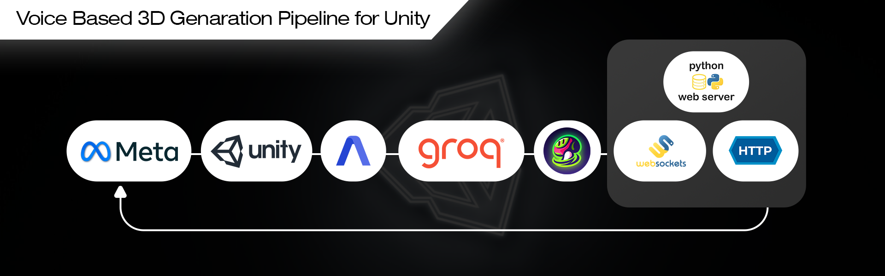

# Voice-to-3D Pipeline   Real-Time VR Asset Generation System

A production-oriented system that converts spoken voice commands inside a Meta Quest VR headset into fully textured 3D GLB assets, injected live into a Unity scene. The pipeline bridges VR input, real-time audio transcription, LLM prompt optimization, and AI-powered 3D model generation through a persistent WebSocket server.

**Contact:** shnofficialmail@gmail.com  
**Target Platform:** Meta Quest 2 / 3 (via OVR SDK) + Windows/Linux Python Server  
**Unity Version:** 2022.3 LTS or newer (URP recommended)  

---

## Table of Contents

1. [System Architecture](#1-system-architecture)  
2. [Technology Stack](#2-technology-stack)  
3. [Repository Structure](#3-repository-structure)  
4. [Pipeline Diagram](#4-pipeline-diagram)  
5. [Server Setup   Python Backend](#5-server-setup--python-backend)  
6. [Unity Setup](#6-unity-setup)  
7. [Unity Inspector Configuration](#7-unity-inspector-configuration)  
8. [In-Headset HUD   Meta Quest View](#8-in-headset-hud--meta-quest-view)  
9. [Configuration Reference](#9-configuration-reference)  
10. [API Keys and External Services](#10-api-keys-and-external-services)  
11. [Network Requirements](#11-network-requirements)  
12. [Known Limitations](#12-known-limitations)  
13. [License](#13-license)  

---

## 1. System Architecture

The system is divided into two discrete runtime environments that communicate over a persistent WebSocket connection.

```
[Meta Quest Headset]                    [Host Machine   Python Server]
        |                                           |
  OVR Y-Button / Spacebar                  WebSocket :8080
  VoiceTranscriptionManager.cs  <-------->  server.py (asyncio)
        |                                           |
  HUD Overlay (World-space Canvas)          AssemblyAI (Speech-to-Text)
  GLB Loader & Inventory Manager            Groq API  (Prompt Refinement)
                                            Meshy API (3D Generation)
                                            HTTP File Server :8000 (GLB delivery)
```

The Unity client sends raw control signals (`start` / `stop`) to the server. The server handles all computation-heavy steps, then returns a base64-encoded GLB file alongside an HTTP URL for fallback retrieval. Unity decodes and instantiates the mesh at runtime.

---

## 2. Technology Stack

| Layer | Technology | Purpose |
|---|---|---|
| VR Runtime | Meta Quest SDK (OVRInput) | Controller input capture |
| Game Engine | Unity 2022.3+ (C#) | Scene management, HUD, mesh loading |
| Communication | WebSocketSharp | Persistent bidirectional messaging |
| UI | TextMeshPro, Unity UI | World-space HUD rendering |
| Server Runtime | Python 3.10+, asyncio | Non-blocking pipeline orchestration |
| Audio Capture | sounddevice, numpy | Microphone stream acquisition |
| Transcription | AssemblyAI REST API | Speech-to-text conversion |
| Prompt Refinement | Groq API (LLaMA 3) | Natural language optimization for 3D prompts |
| 3D Generation | Meshy AI API | Text-to-3D GLB model generation |
| File Delivery | Python http.server (ThreadingTCPServer) | GLB asset HTTP serving |
| Dashboard | Tkinter | Operator-facing server GUI |

---

## 3. Repository Structure

```
voice-to-3d-pipeline/
|
|-- server/
|   |-- server.py                  # Main WebSocket server and pipeline orchestrator
|   |-- config.py                  # Host, port, API key configuration
|   |-- assembly_ai.py             # AssemblyAI upload and transcription wrapper
|   |-- groq_prompt.py             # Groq LLM prompt enhancement module
|   |-- meshy_generator.py         # Meshy API 3D generation module
|   |-- models/                    # Output directory for generated GLB files
|   |-- requirements.txt
|
|-- unity/
|   |-- Assets/
|   |   |-- Scripts/
|   |   |   |-- VoiceTranscriptionManager.cs   # Core client controller
|   |   |-- Prefabs/
|   |   |   |-- RecordingHUD.prefab            # World-space status overlay
|   |-- Packages/
|       |-- manifest.json                      # Includes WebSocketSharp reference
|
|-- screenshots/
|   |-- pipeline_diagram.png
|   |-- unity_inspector.png
|   |-- meta_quest_hud.png
|
|-- README.md
```

---

## 4. Pipeline Diagram



**Stage-by-stage execution flow:**

```
[1] User presses Y-button (OVR) or Spacebar (Editor)
        |
        v
[2] Unity sends {"action": "start"} over WebSocket
        |
        v
[3] Python server opens sounddevice InputStream, begins audio_callback buffering
        |
        v
[4] User releases button -> Unity sends {"action": "stop"}
        |
        v
[5] server.py stops stream, writes .wav to disk
        |
        v
[6] assembly_ai.py uploads WAV, polls AssemblyAI, returns transcript
        |
        v
[7] groq_prompt.py sends transcript to Groq (LLaMA 3), receives optimized 3D prompt
        |
        v
[8] meshy_generator.py submits prompt to Meshy API, polls preview -> refine stages
        |
        v
[9] Final GLB downloaded, renamed with voice-derived slug + timestamp, saved to /models/
        |
        v
[10] server.py base64-encodes GLB, sends {"type": "model_ready", "data": "...", "url": "..."}
        |
        v
[11] Unity decodes base64 -> writes GLB to Application.persistentDataPath -> loads mesh
        |
        v
[12] 3D asset instantiated in scene, HUD transitions to COMPLETED state
```

---

## 5. Server Setup   Python Backend

### 5.1 Prerequisites

- Python 3.10 or higher
- pip package manager
- A stable network interface accessible to the Meta Quest headset (same LAN or USB link)
- API accounts for: AssemblyAI, Groq, Meshy

### 5.2 Installation

```bash
# Clone the repository
git clone https://github.com/YOUR_USERNAME/voice-to-3d-pipeline.git
cd voice-to-3d-pipeline/server

# Create and activate a virtual environment (recommended)
python -m venv venv

# Windows
venv\Scripts\activate

# macOS / Linux
source venv/bin/activate

# Install dependencies
pip install -r requirements.txt
```

**requirements.txt:**
```
websockets>=12.0
sounddevice>=0.4.6
numpy>=1.24.0
scipy>=1.11.0
assemblyai>=0.20.0
groq>=0.5.0
requests>=2.31.0
```

### 5.3 Configuration

Open `config.py` and populate the following fields:

```python
# config.py

SERVER_HOST = "0.0.0.0"       # Bind to all interfaces (required for Quest access)
SERVER_PORT = 8080             # WebSocket port

SAMPLE_RATE = 16000            # Hz   AssemblyAI recommended rate
FILENAME    = "recording.wav"  # Temporary audio file

# API Keys
ASSEMBLYAI_API_KEY = "YOUR_ASSEMBLYAI_KEY"
GROQ_API_KEY       = "YOUR_GROQ_KEY"
MESHY_API_KEY      = "YOUR_MESHY_KEY"
```

### 5.4 Running the Server

```bash
python server.py
```

On successful startup, the terminal and Tkinter dashboard will display:

```
=======================================
  VOICE-TO-3D PIPELINE SERVER STARTED
  WebSocket: ws://0.0.0.0:8080
  File Server: http://0.0.0.0:8000
=======================================
```

The dashboard provides:
- Live pipeline status label (color-coded)
- Connected Unity client count
- Scrollable log output (stdout redirected)
- Saved models inventory (auto-refreshed after each generation)

### 5.5 Firewall Rules

Ensure the following inbound ports are open on the host machine:

| Port | Protocol | Purpose |
|---|---|---|
| 8080 | TCP | WebSocket (Unity <-> Server) |
| 8000 | TCP | HTTP GLB file delivery |

---

## 6. Unity Setup

### 6.1 Prerequisites

- Unity 2022.3 LTS or newer
- Meta XR SDK / OVR Plugin (installed via Package Manager or import from Meta's developer site)
- TextMeshPro (installed via Package Manager   Window > Package Manager > TextMeshPro)
- WebSocketSharp DLL (see below)

### 6.2 WebSocketSharp Integration

WebSocketSharp is not available on the Unity Package Manager registry. Install it manually:

1. Download the latest release from: `https://github.com/sta/websocket-sharp`
2. Build the project in Visual Studio to produce `websocket-sharp.dll`, or download a pre-compiled DLL.
3. Place the DLL at: `Assets/Plugins/websocket-sharp.dll`
4. In Unity, select the DLL in the Project window. In the Inspector, ensure **API Compatibility Level** matches your project (`NET 4.x` or `NET Standard 2.1`).

### 6.3 Script Placement

Place `VoiceTranscriptionManager.cs` inside `Assets/Scripts/`. Unity will compile it automatically on import.

### 6.4 Scene Configuration

1. Create an empty GameObject in the scene hierarchy. Name it `VoiceTranscriptionManager`.
2. Attach the `VoiceTranscriptionManager.cs` script component to it.
3. Configure the Inspector slots as described in Section 7.
4. Build and deploy to the Meta Quest headset using the standard OVR build workflow (File > Build Settings > Android > Build and Run).

---

## 7. Unity Inspector Configuration


The following table documents every serialized field on `VoiceTranscriptionManager.cs` and what Unity object or asset must be assigned to each slot.

### Network Settings

| Field | Type | Required Value | Description |
|---|---|---|---|
| Server Address | string | `ws://192.168.X.X:8080` | Replace with the LAN IP address of the host machine running `server.py`. Do not use `localhost` when deploying to a physical Quest headset. |
| Reconnect Interval | float | `5` | Seconds between automatic reconnection attempts if the WebSocket drops. |

### HUD UI Elements

| Field | Type | What to Assign | Description |
|---|---|---|---|
| Recording HUD | GameObject | `RecordingHUD` prefab instance in scene | The root GameObject of the world-space Canvas that displays pipeline status. Must be present in the scene (not just in Project) and dragged into this slot. |
| Main Status Text | TextMeshProUGUI | TMP component labeled `MainStatusText` inside RecordingHUD | Displays the primary state string: LISTENING, PROCESSING, OPTIMIZING, TEXTURING, DOWNLOADING, COMPLETED, FAILED, ERROR. |
| Detail Status Text | TextMeshProUGUI | TMP component labeled `DetailStatusText` inside RecordingHUD | Displays the secondary descriptive line beneath the main status. |
| HUD Close Button | Button | Button component labeled `CloseButton` inside RecordingHUD | When clicked, sets `manuallyClosed = true` and hides the HUD. Wire this in Inspector, not via code. |
| HUD Follow Distance | float | `1.2` | Meters in front of the camera at which the HUD positions itself. Increase if the panel clips into objects. |

**RecordingHUD Prefab Internal Structure (required hierarchy):**

```
RecordingHUD  [GameObject   World Space Canvas]
|-- Panel  [Image   background]
    |-- MainStatusText   [TextMeshProUGUI]
    |-- DetailStatusText [TextMeshProUGUI]
    |-- CloseButton      [Button > Text]
```

Set the Canvas **Render Mode** to `World Space`. Set **Width** to approximately `0.5` and **Height** to `0.15` (Unity units). The script will drive position every frame via `UpdateHUDPosition()`.

### Audio Settings

| Field | Type | What to Assign | Description |
|---|---|---|---|
| Audio Source | AudioSource | AudioSource component on the same or child GameObject | Used to play one-shot audio clips for completion and error feedback. |
| Completion Sound | AudioClip | Any short success sound asset in the Project | Played when `model_ready` is received, after a 2-second delay. |
| Error Sound | AudioClip | Any short error/alert sound asset in the Project | Played immediately when an `error` message is received from the server. |

### Static Events (consumed by other scripts)

`VoiceTranscriptionManager.cs` exposes three static C# events. Other MonoBehaviours in the scene can subscribe to these:

| Event | Signature | Fired When |
|---|---|---|
| `OnTranscriptReceived` | `Action<string>` | Server sends transcript text (raw or optimized) |
| `OnStatusUpdate` | `Action<string>` | Server sends a status string update |
| `OnModelReady` | `Action<string>` | Server confirms model is ready; passes filename |

**Example subscription from another script:**
```csharp
void OnEnable()
{
    VoiceTranscriptionManager.OnModelReady += HandleModelReady;
}

void OnDisable()
{
    VoiceTranscriptionManager.OnModelReady -= HandleModelReady;
}

private void HandleModelReady(string filename)
{
    // Load and instantiate the GLB from Application.persistentDataPath
}
```

---

## 8. In-Headset HUD   Meta Quest View


The HUD is a world-space canvas that renders in front of the player at a fixed forward distance. It follows the camera smoothly using lerp interpolation (coefficient `5.0 * deltaTime`) and always faces the player by calling `LookAt` followed by a 180-degree Y-axis rotation to correct for Unity's forward convention.

**HUD State Reference:**

| State Label | Color | Trigger Condition |
|---|---|---|
| LISTENING | White | `start` action sent, server confirmed |
| PROCESSING | White | `stop` action sent |
| OPTIMIZING | White | Server reports Gemini or Groq activity |
| PREVIEW [X%] | White | Meshy preview generation in progress |
| TEXTURING [X%] | White | Meshy refine/texturing in progress |
| DOWNLOADING | White | GLB file transfer in progress |
| COMPLETED | Green | `model_ready` received + 2s delay |
| FAILED | Red | `error` message received from server |
| ERROR | Red | WebSocket offline on button press |

The HUD is hidden by default at scene start (`recordingHUD.SetActive(false)`). It is force-hidden after a configurable delay (`ForceHideHUDAfterDelay`) following terminal states (COMPLETED, FAILED, ERROR) to prevent the panel from persisting on-screen indefinitely. The user can also dismiss it manually via the close button.

---

## 9. Configuration Reference

| Parameter | Location | Default | Notes |
|---|---|---|---|
| `SERVER_HOST` | `config.py` | `"0.0.0.0"` | Bind address for server |
| `SERVER_PORT` | `config.py` | `8080` | WebSocket port |
| `HTTP_PORT` | `server.py` | `8000` | GLB file server port |
| `SAMPLE_RATE` | `config.py` | `16000` | Audio sample rate in Hz |
| `FILENAME` | `config.py` | `"recording.wav"` | Temp WAV output path |
| `reconnectInterval` | Unity Inspector | `5.0` | Auto-reconnect delay (seconds) |
| `hudFollowDistance` | Unity Inspector | `1.2` | HUD distance from camera (meters) |
| `max_retries` | `server.py` | `3` | Retry count for API calls |
| `retry delay` | `server.py` | `2.0s` | Delay between retries |
| `max_size` | `server.py` websockets.serve | `10^8` bytes | Max WebSocket message size (100 MB) |

---

## 10. API Keys and External Services

### AssemblyAI

- Register at: `https://www.assemblyai.com`
- Used for: WAV file upload and asynchronous transcription polling
- Free tier available with rate limits
- Set key in `config.py` as `ASSEMBLYAI_API_KEY`

### Groq

- Register at: `https://console.groq.com`
- Used for: LLaMA 3 inference to convert raw voice transcript into a structured Meshy-compatible 3D generation prompt
- Free tier available
- Set key in `config.py` as `GROQ_API_KEY`

### Meshy AI

- Register at: `https://www.meshy.ai`
- Used for: Text-to-3D generation (preview stage + refine/texture stage)
- GLB output format
- Set key in `config.py` as `MESHY_API_KEY`

**Security Note:** Do not commit `config.py` containing live API keys to a public repository. Add it to `.gitignore` and distribute a `config.example.py` template instead.

---

## 11. Network Requirements

- The Python server host machine and the Meta Quest headset must be on the same local area network, or connected via USB Link/Air Link with network bridging enabled.
- Obtain the host machine's LAN IP address (`ipconfig` on Windows, `ip addr` on Linux).
- Enter this IP in the Unity Inspector field **Server Address** as: `ws://192.168.X.X:8080`
- The server binds to `0.0.0.0`, meaning it accepts connections on all available network interfaces.
- The HTTP file server on port 8000 is used to provide a URL reference in the `model_ready` payload. Unity currently uses the base64-encoded `data` field for actual transfer, so the HTTP server is available as a fallback or for independent file retrieval via the `request_file` action.

---

## 12. Known Limitations

| Limitation | Detail |
|---|---|
| Single concurrent client | The pipeline uses global `is_recording` and `is_processing` flags. Multiple simultaneous Unity clients will conflict. |
| Blocking audio on server | `sounddevice` captures on the server machine's microphone. The headset's internal microphone is not used. |
| No authentication | The WebSocket server accepts any connection on the configured port. Do not expose port 8080 to the public internet. |
| GLB runtime loading | Unity does not natively support GLB loading at runtime. A third-party GLB importer (e.g., GLTFUtility or UniGLTF) must be integrated to load the decoded file. |
| Meshy generation time | Full preview + refine generation typically takes 60–180 seconds depending on prompt complexity and API queue load. |
| Audio format | Only 16-bit mono WAV at 16000 Hz is tested with AssemblyAI. Other configurations may require changes to `assembly_ai.py`. |

---

## 13. License

This project is released for educational and research purposes. Third-party services (AssemblyAI, Groq, Meshy) are subject to their respective terms of service and usage limits. The OVR SDK is subject to Meta's Platform SDK license agreement.

---

*Maintained by shnofficialmail@gmail.com*
